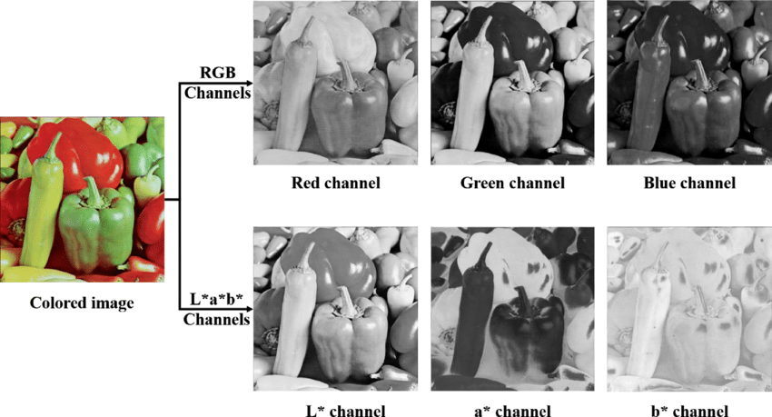
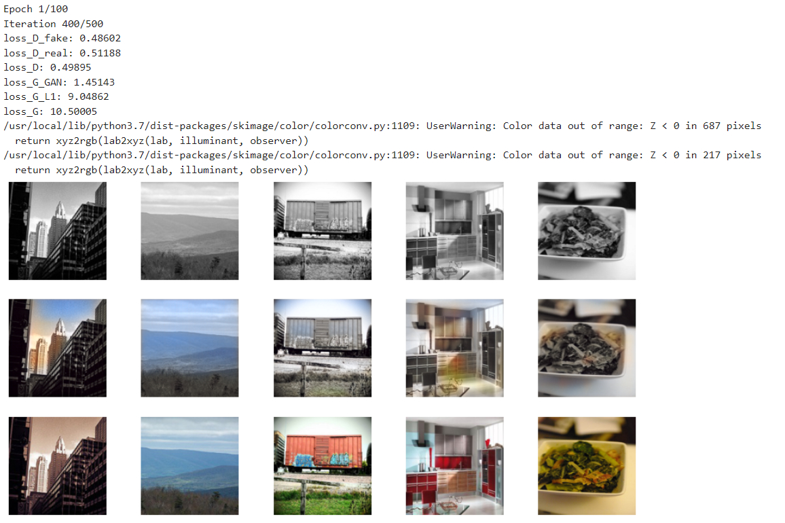
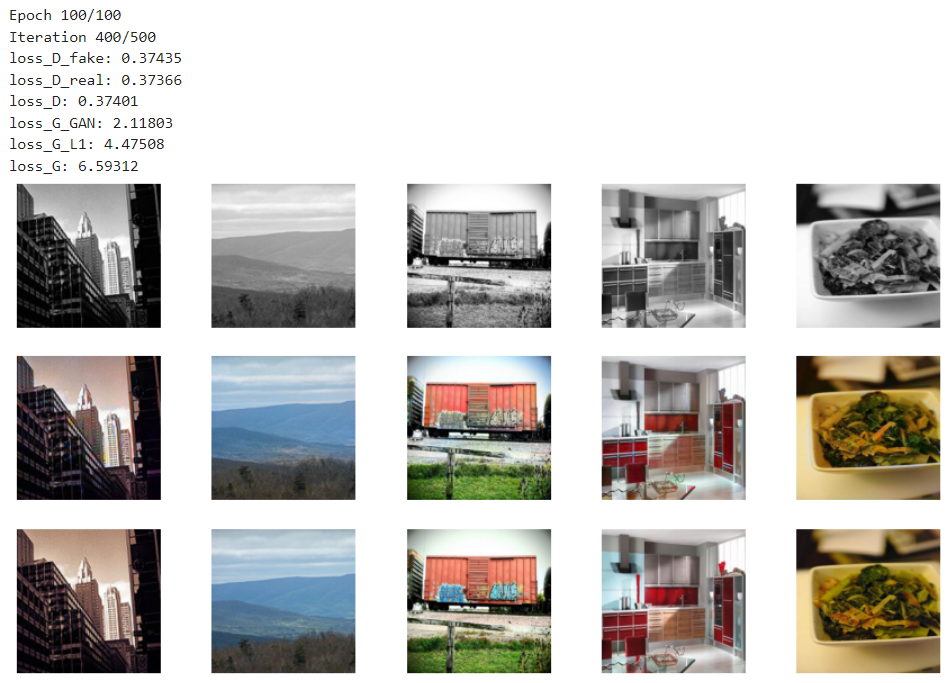
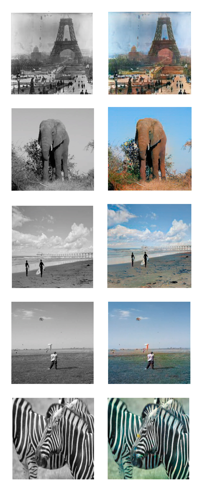

# Photo-Lab 📸✨

When we see old pictures somehow they feel distant to us. That's because a key element is missing: The color!!
The task of colorizing Black and White Photos This task could seem like a lot of work but the whole process can be done with the power of AI and Neural Networks.
Let's see how that works with the use of GAN's and U-Net.

## Colorization Problem 🌈🧐

Most images are in the RGB Format, in which we get a rank-3 (height, width, color) array with the last axis containing the color data for our image. These data represent color in RGB color space and there are 3 numbers for each pixel indicating how much Red, Green, and Blue the pixel is. In Lab color space, we have again three numbers for each pixel but these numbers have different meanings. The first number (channel), L, encodes the Lightness of each pixel and when we visualize this channel (the second image in the row below) it appears as a black and white image. The *a and *b channels encode how much green-red and yellow-blue each pixel is, respectively.

In order to train our model, the Lab format is the way to go, the L channel will be our grayscale image, and the *a and *b channels the data to predict. Instead of 3 values to predict using RGB format, which is a more difficult and unstable task due to the many more possible combinations of 3 numbers compared to two numbers

## The Dataset
For this case we a battle already won, for the data neeed to train the model any regular image will do. Therefore this task becomes the easy part. For this, the model where train mostly with landscape and street pictures, so the predictions works mainly for historical pictures!

*foto dataset*

## The Model 💻⚙

In this approach two losses are used: L1 loss, which makes it a regression task, and an adversarial (GAN) loss, which helps to solve the problem in an unsupervised manner 

For the model stracuture a GAN will be used in which we have a generator and a discriminator model which learn to solve a problem together. In our setting, the generator model takes a grayscale image (1-channel image) and produces a 2-channel image, a channel for *a and another for *b. The discriminator, takes these two produced channels and concatenates them with the input grayscale image and decides whether this new 3-channel image is fake or real. Of course the discriminator also needs to see some real images (3-channel images again in Lab color space) that are not produced by the generator and should learn that they are real.

## Some Results!

## How to use 🤓

1. Clone the repository with https://github.com/Medicenab/Photo-Lab.git
2. Download the model from this link  `models/model_GAN_100epochs.pth` and save it in the same folder. ❗❗IMPORTANT❗❗
3. To install all the things needed - pip install -r requirements.txt
4. To run the app on http://localhost:8501 run streamlit run main.py

